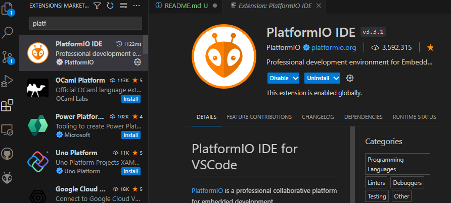
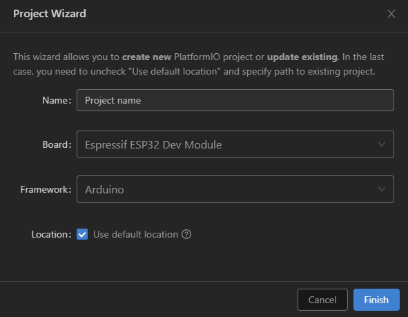
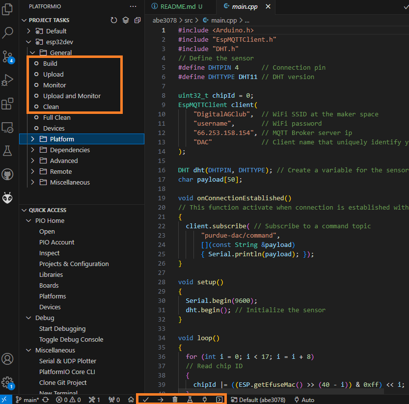

# How To Use Platform IO

[Platform IO](https://platformio.org/) is a IDE for embedded system development.
The easiest way to use Platform IO is as VS Code's extension.
Alternatively, Arduino IDE work but this tutorial will only cover Platform IO.

## Installation

In VS Code extension, search for "Platform IO IDE". After installation, you will see a new icon on the left panel.



## Create a New Project

Platform IO support hundreds of microcontrollers.
Therefore, you must know the model of the microcontroller you are working on.
In this case, we are using ESP32 Devkit with Arduno framework.



Every Platform IO project comes with a certain structure.
The source code will locate in `src` folder.

### Open an Existing Project

You will need to look at the folder that contain `platformio.ini`.
This file is a configuration file for every platform IO project.

## Compile and Upload Source Code

You will find a tab of the left side for building, uploading, and monitoring.
You will also find the same set of command on the bottom panel.



**Note** For Linux user, you might need to grant a permission for VS Code + Platform IO to access USB device.
Use the following command.
Change `ttyUSB0` to other USB device if needed.

```bash
sudo chmod a+rw /dev/ttyUSB0
```
